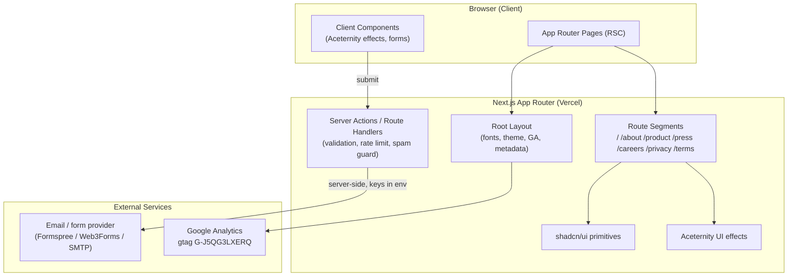
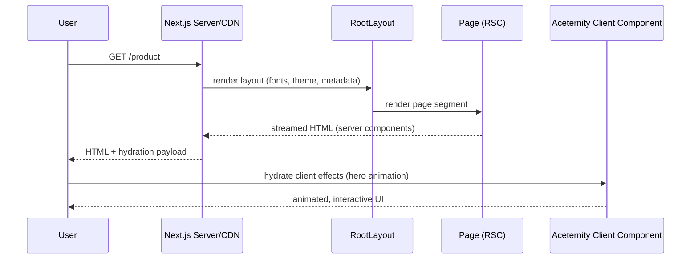
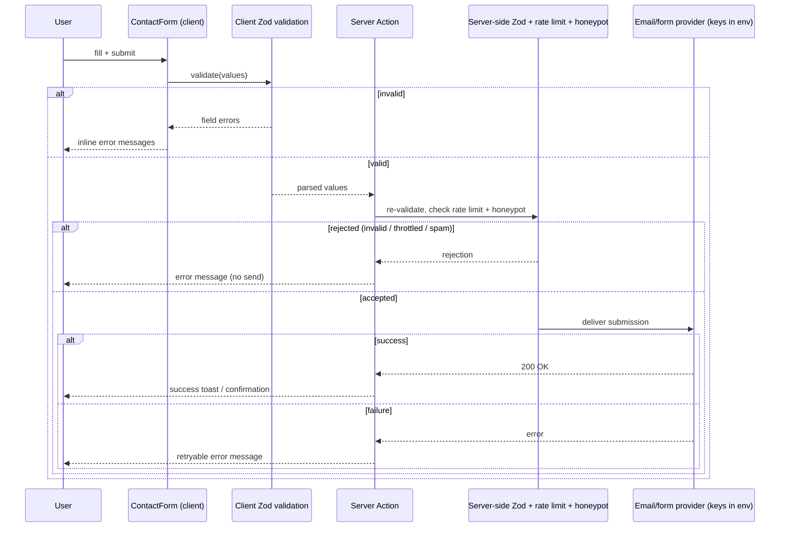

# Design Document: Website Rebuild (Next.js)

## Overview

This project rebuilds the existing BioAnalytiX marketing site, currently a static HTML5 UP
template powered by jQuery and particles.js, as a modern Next.js application. The new stack
uses the Next.js **App Router**, **Tailwind CSS** for styling, **shadcn/ui** for accessible
primitive components (buttons, forms, dialogs, navigation), and **Aceternity UI** for the
animated/visual effects that replace the legacy particle background and scroll animations.

The rebuild preserves all existing **content** (Home, About Us, Our Product/Orasis AI, Press & News,
Careers, Privacy Policy, Terms & Conditions, 404), the two form integrations (contact form and
beta/careers application form — now handled server-side, see below), Google Analytics
(G-J5QG3LXERQ), and SEO metadata (Open Graph, Twitter cards, canonical URLs).

It also **redesigns the visual identity**. The legacy site leaned on a dark particle-field theme
(particles.js hero, dark Aceternity background, jQuery scroll animations, Manrope, a single
"highlight-text" accent). The redesign deliberately moves to a **light + bold enterprise SaaS**
aesthetic — a polished, trustworthy B2B feel in the spirit of Linear and Stripe: a near-white base,
confident bold typography, a single strong brand accent, generous whitespace, and tasteful,
light-friendly motion (subtle grid/spotlight/gradient accents and smooth scroll reveals) instead of a
heavy dark particle field. The concrete tokens, type scale, spacing, component styling, motion, and
accessibility targets for this direction are specified in the **Visual Design Language** section
below, and all downstream component, page, and theming decisions in this document follow it.

A key cross-cutting decision is **deployment target**, and it is now settled: the site will be
deployed to **Vercel** after completion. The custom domain `bioanalytix.info` (still tracked by the
repo `CNAME` file) is repointed from GitHub Pages to Vercel. Choosing Vercel as the single target
unlocks the full Next.js feature set — **Server Actions / Route Handlers**, automatic **image
optimization** via `next/image`, and edge rendering — so there is no static-export compromise and no
third-party-only forms constraint. Consequently the forms are designed server-first (Server Actions
with server-side Zod validation, secret-bearing provider keys kept in environment variables, plus
rate limiting and honeypot/spam protection). The legacy static site has been moved into a `Legacy/`
folder in the repository and is **excluded from the build and deploy** (it is neither part of the
Next.js `app/` tree nor published by Vercel).

## Architecture



### Decision Records

| Decision | Choice | Rationale |
|----------|--------|-----------|
| Router | App Router | Modern default, RSC support, file-based metadata API for SEO |
| Styling | Tailwind CSS + CSS variables | Maps cleanly to existing utility-driven CSS; design-system tokens (light + bold) for color/type/spacing |
| Primitives | shadcn/ui | Copy-in components, accessible (Radix), fully themeable |
| Effects | Aceternity UI (light-friendly) | Replaces particles.js + jQuery scroll fade-ups with subtle grid/spotlight/gradient accents and React-native scroll reveals |
| Theme | Light-first, bold enterprise SaaS | Shift from legacy dark particle theme to a polished B2B look (Linear/Stripe spirit); dark mode optional/secondary |
| Primary navigation | Top sticky header/navbar (replaces left sidebar) | Modern enterprise SaaS convention (Linear/Stripe/Vercel): logo + horizontal nav links + primary CTA in a sticky top bar; left sidebar dropped. Mobile collapses to a hamburger that opens a shadcn `Sheet` |
| Forms | Next.js Server Actions (primary) | Keys/secrets server-side via env; server-side Zod validation, rate limiting, honeypot/spam guard |
| Form transport | Pluggable `SubmissionStrategy` | `serverActionStrategy` is the primary path; provider POST (Formspree/Web3Forms) retained behind the abstraction as an alternate transport the action can call server-side |
| Image optimization | `next/image` + Vercel | On-demand optimization/responsive images; no `images.unoptimized` |
| Deploy | Vercel (single target) | Confirmed host; unlocks Server Actions, image optimization, edge rendering |
| Domain | `bioanalytix.info` → Vercel | `CNAME` repointed from GitHub Pages to Vercel |
| Legacy site | Moved to `Legacy/`, excluded | Old static HTML kept for reference but not built or deployed |

## Visual Design Language

This section defines the redesign direction: **light + bold enterprise SaaS**. It is the single
source of truth for color, typography, spacing, component styling, motion, iconography, and
accessibility. Every component and page in this document inherits from these tokens — no ad-hoc
hex values, font sizes, or shadows outside the system.

### Design Principles

- **Light-first and bold.** Near-white canvas, high-contrast bold headings, lots of breathing room.
  Confidence comes from typography and whitespace, not from heavy decoration.
- **Trustworthy medical-AI feel.** Calm, clinical neutrals with a single deliberate accent. Avoid
  loud gradients or playful color; the palette should read precise and credible.
- **Tasteful, subtle motion.** Light-friendly accents (faint grid, soft spotlight/gradient glow,
  fade/slide-in on scroll) replace the legacy dark particle field. Motion supports hierarchy, never
  competes with content, and always respects `prefers-reduced-motion`.
- **Systematic, not bespoke.** Color, type, spacing, radius, and elevation are tokens. Consistency
  across pages is enforced by the token set (see Correctness Property 8).

### Color System

Defined as CSS variables on `:root` (light, primary) with an optional `.dark` block (secondary).
Tailwind theme tokens reference the variables so utilities like `bg-background`, `text-foreground`,
`bg-primary`, and `border-border` resolve to the system. Values are HSL for easy tuning.

```css
:root {
  /* Base / surfaces */
  --background: 0 0% 100%;          /* #FFFFFF page canvas */
  --surface:    210 20% 98%;        /* #F8FAFC subtle section / card alt background */
  --foreground: 222 47% 11%;        /* #0F172A near-black slate for primary text */
  --muted:      215 16% 47%;        /* #64748B secondary/supporting text */
  --border:     214 32% 91%;        /* #E2E8F0 hairline borders / dividers */
  --input:      214 32% 91%;
  --ring:       221 83% 53%;        /* focus ring = brand accent */

  /* Brand accent (strong) — confident, clinical blue */
  --primary:            221 83% 53%;   /* #2563EB */
  --primary-foreground: 0 0% 100%;     /* text on primary */
  --primary-hover:      221 83% 46%;   /* darker for hover/active */

  /* Supporting accent — teal/cyan for highlights, data viz, secondary CTAs */
  --accent:             190 95% 39%;   /* #06B6D4 */
  --accent-foreground:  222 47% 11%;

  /* Semantic */
  --success: 142 71% 45%;   /* #22C55E */
  --warning: 38 92% 50%;    /* #F59E0B */
  --error:   0 84% 60%;     /* #EF4444 */

  --radius: 0.75rem;
}

/* Optional dark mode (secondary; not the primary brand surface) */
.dark {
  --background: 222 47% 7%;
  --surface:    222 40% 11%;
  --foreground: 210 20% 98%;
  --muted:      215 20% 65%;
  --border:     217 33% 20%;
  --primary:            221 83% 60%;
  --primary-foreground: 222 47% 11%;
  --accent:             190 90% 50%;
}
```

**Mapping to shadcn/ui theming.** shadcn components consume a fixed set of CSS-variable names. The
brand tokens above are surfaced through those exact names so every shadcn primitive (Button, Card,
Input, Sheet, NavigationMenu, Dialog) themes automatically. The full shadcn variable set, derived
from the brand tokens, is:

```css
:root {
  /* shadcn surface + text pairs (derived from brand tokens above) */
  --card:                  0 0% 100%;     /* = --background */
  --card-foreground:       222 47% 11%;   /* = --foreground */
  --popover:               0 0% 100%;
  --popover-foreground:    222 47% 11%;
  --muted-foreground:      215 16% 47%;   /* = --muted (secondary text) */

  /* primary / secondary / accent (secondary = neutral surface chip) */
  --secondary:             210 20% 98%;   /* = --surface, used by secondary buttons/badges */
  --secondary-foreground:  222 47% 11%;

  /* destructive maps to the --error semantic token */
  --destructive:            0 84% 60%;    /* = --error */
  --destructive-foreground: 0 0% 100%;
}

.dark {
  --card:                  222 40% 11%;
  --card-foreground:       210 20% 98%;
  --popover:               222 40% 11%;
  --popover-foreground:    210 20% 98%;
  --muted-foreground:      215 20% 65%;
  --secondary:             222 40% 14%;
  --secondary-foreground:  210 20% 98%;
  --destructive:            0 72% 51%;
  --destructive-foreground: 210 20% 98%;
}
```

The Tailwind `theme.extend.colors` block points `background`, `foreground`, `card`, `popover`,
`primary`, `secondary`, `muted`, `accent`, `border`, `input`, `ring`, and `destructive` at these
variables (`hsl(var(--token))`), which is the standard shadcn wiring — so swapping light↔dark is a
single class toggle on `<html>`.

**Usage rules**
- One strong accent (`--primary` blue) drives primary CTAs, links, active states, and focus rings.
- The supporting accent (`--accent` teal) is used sparingly: secondary CTAs, iconography highlights,
  data/feature accents — never as a competing primary.
- Neutrals (`--foreground` / `--muted` / `--border`) carry text and structure; large fields of color
  are avoided to keep the clinical, trustworthy tone.
- Semantic colors are reserved for state (form success/error/warning), not decoration.

### Typography

A single, confident type system built on **Manrope** — self-hosted via `next/font/local` (or
`next/font/google`) for zero render-blocking requests. Manrope is retained from the legacy site for
brand continuity, but it is now pushed into a **bold, large-scale display treatment** for headings
(heavy weights, big sizes, tight tracking) while remaining the readable body face. This gives the
"big confident typography" of a Linear/Stripe marketing site from one well-tuned family.

- **Display / headings:** `Manrope` at 700–800 weight, large sizes, tight tracking (`-0.02em`) for
  bold, modern headlines.
- **Body / UI:** `Manrope` at 400/500 for paragraphs and UI, 600 for emphasis.

Exposed as CSS variables `--font-display` and `--font-sans` (both Manrope; the split keeps the door
open for a separate display face later without touching components); Tailwind maps `font-display`
and `font-sans`. Type scale (fluid where useful via `clamp`):

| Token | Size / line-height | Weight | Usage |
|-------|--------------------|--------|-------|
| `display` | `clamp(2.75rem, 6vw, 4.5rem)` / 1.05 | 700 | Hero headline |
| `h1` | 3rem / 1.1 | 700 | Page title |
| `h2` | 2.25rem / 1.15 | 700 | Section heading |
| `h3` | 1.5rem / 1.25 | 600 | Card / sub-section |
| `lead` | 1.25rem / 1.6 | 400 | Hero/section intro paragraph |
| `body` | 1rem / 1.7 | 400 | Default copy |
| `small` | 0.875rem / 1.5 | 500 | Captions, labels, meta |
| `overline` | 0.75rem / 1.4, tracking +0.08em, uppercase | 600 | Eyebrow/section kicker |

Headings use tight tracking (`-0.02em`) for the bold, modern feel; body uses default tracking.

### Spacing & Layout

- **Container:** centered, `max-width: 1280px` (`max-w-7xl`), horizontal padding `1.5rem` mobile →
  `2rem` desktop. A narrower `max-w-3xl` (≈768px) measure is used for long-form prose (privacy,
  terms, press body).
- **Spacing scale:** Tailwind default 4px base (`4, 8, 12, 16, 24, 32, 48, 64, 96, 128`). Components
  compose from this scale only.
- **Section rhythm:** consistent vertical padding `py-24` desktop / `py-16` mobile between major
  sections; `gap-8`–`gap-12` for grids. Generous whitespace is a primary design device.
- **Grid:** 12-column mental model; feature/press grids use `grid-cols-1 md:grid-cols-2
  lg:grid-cols-3`.
- **Breakpoints:** Tailwind defaults — `sm 640`, `md 768`, `lg 1024`, `xl 1280`, `2xl 1536`.

### Components & Cards

- **Radius scale:** `--radius` = `0.75rem`; `sm` 0.5rem (inputs/badges), `md` 0.75rem (buttons),
  `lg` 1rem (cards), `xl` 1.5rem (feature/hero panels).
- **Elevation:** restrained, layered shadows on a light base rather than borders alone.
  - `shadow-sm`: resting cards (`0 1px 2px rgb(15 23 42 / 0.06)`).
  - `shadow-md`: hovered/raised cards (`0 8px 24px -8px rgb(15 23 42 / 0.12)`).
  - `shadow-lg`: popovers/dialogs.
  Cards also carry a 1px `--border` hairline so they read crisply on white.
- **Cards (SaaS style):** white surface, `rounded-lg`, hairline border, `shadow-sm`, `p-6`–`p-8`.
  Hover: lift to `shadow-md`, border tints toward `--primary`, subtle `-translate-y-0.5`, 150–200ms.
- **Buttons:**
  - *Primary:* solid `--primary`, white text, `rounded-md`, `shadow-sm`; hover → `--primary-hover`.
  - *Secondary:* white/`--surface` background, `--border`, `--foreground` text; hover bg `--surface`.
  - *Ghost/link:* transparent, `--primary` text, underline-on-hover.
  - All buttons show a visible `--ring` focus outline (keyboard accessible).
- **Inputs:** white background, `--border`, `rounded-md`; focus → `--ring` 2px outline + border tint.
  Error state uses `--error` border + helper text.
- **Top navbar:** sticky `top-0`, full-width, `h-16`, transparent/`--background` at the top of the
  page transitioning to a `--background/80` translucent bar with `backdrop-blur` and a bottom
  `--border` hairline once scrolled. Contents: logo (left), horizontal nav links (`small`/`body`
  weight 500, `--muted` → `--foreground` on hover/active), and a single **primary CTA button**
  (right). On `< md` the links collapse into a hamburger that opens a shadcn `Sheet` from the right;
  the CTA stays visible. Active link gets a `--primary` underline/indicator.
- **Forms:** single-column, generous `space-y-5`, labels in `small` weight 500, inputs per the input
  style above, helper/error text in `small`. Primary submit uses the primary button; disabled while
  pending with a spinner. Success renders a `--success`-tinted confirmation; errors a non-destructive
  `--error` inline message that preserves entered values.
- **Footer:** `--surface` background with a top `--border` hairline, `py-16`, multi-column link grid
  (`grid-cols-2 md:grid-cols-4`) under the logo + short tagline, with legal links (Privacy, Terms)
  and copyright in a `small` `--muted` baseline row.

### Motion

Subtle, professional micro-interactions via `framer-motion`, gated on `prefers-reduced-motion`.
These replace the legacy jQuery scroll animations and the particle field entirely.

- **Scroll reveals:** sections/cards fade + rise (`opacity 0→1`, `y 16→0`, 400–500ms, ease-out) when
  entering the viewport, with small stagger across grid items.
- **Hover micro-interactions:** card lift, button color/shadow transitions (150–200ms).
- **Hero accent motion:** a slow, light-friendly gradient/spotlight drift and/or faint animated grid
  behind the headline — low contrast, never distracting. The rotating-word effect is retained.
- **Reduced motion:** when `prefers-reduced-motion: reduce`, all of the above render a static final
  frame and start no timers/observers (see Correctness Properties 4 and 7).

**Aceternity components — fit the light enterprise aesthetic (use):**
- *Background Grid / Grid-and-Dot* and *Background Gradient* — faint, low-contrast grid or soft
  gradient wash behind the hero (light-tuned, not a dark glowing field).
- *Spotlight* — a single soft, light spotlight to add depth without darkness.
- *Text Generate Effect / Typewriter* — drives the hero rotating words (`rotatingWords`) in `--primary`.
- *Fade-in / scroll-reveal wrappers* — for section and card entrance (or plain `framer-motion`).
- *Bento Grid* + card hover (border tint to `--primary`, lift to `shadow-md`) — for the feature grid.

**Avoid (too heavy/dark for this direction):** dark glowing particle/aurora backgrounds, neon
"meteors"/sparkles, strong colored glows, and any effect that relies on a dark canvas for contrast.
All motion stays subtle and is gated by `prefers-reduced-motion`.

### Iconography & Imagery

- **Icons:** `lucide-react` exclusively (replaces FontAwesome). 1.5–2px stroke, sized `20`/`24`,
  colored `--muted` by default and `--primary`/`--accent` when used as a feature accent. Feature
  cards pair an icon in a soft tinted square (`bg-primary/10`, `rounded-lg`).
- **Imagery:** product/UI screenshots framed in a rounded device/browser mockup with `shadow-md` and
  a hairline border, sitting on `--surface`. Team/about photos use consistent `rounded-lg`, neutral
  treatment, and a uniform aspect ratio. Avoid dark, busy backgrounds; imagery should sit cleanly on
  the light canvas. Use `next/image` with Vercel image optimization for responsive, lazy-loaded assets.

### Accessibility (Color Contrast)

Targets **WCAG 2.1 AA** for the light theme (validated with axe/Lighthouse; AA-level automated
checks only — full conformance still requires manual testing with assistive technology):

- Body text `--foreground` on `--background`: ≥ 4.5:1 (slate `#0F172A` on white ≈ 17:1). ✔
- `--muted` secondary text on `--background`: ≥ 4.5:1 for normal text (≈ 4.7:1). ✔
- `--primary-foreground` (white) on `--primary` (`#2563EB`): ≥ 4.5:1 (≈ 4.6:1). ✔
- Non-text UI (borders, icons, focus ring) vs adjacent color: ≥ 3:1.
- Focus indicator (`--ring`) visible on all interactive elements; never removed without replacement.
- Color is never the sole carrier of meaning (semantic states also use icon/text).


### Page Render (App Router)



### Contact Form Submission



## Project Structure (App Router)

```text
app/
  layout.tsx                 # Root layout: display+body fonts (next/font), light theme tokens, GA, default metadata
  page.tsx                   # Home (hero, trust bar, product features, press, CTA, contact)
  about/page.tsx             # About Us
  product/page.tsx           # Our Product / Orasis AI
  press/page.tsx             # Press & News (article anchors preserved)
  careers/page.tsx           # Careers + beta application form
  privacy-policy/page.tsx
  terms-conditions/page.tsx
  not-found.tsx              # 404
  sitemap.ts                 # SEO sitemap
  robots.ts
components/
  ui/                        # shadcn/ui primitives (button, input, form, sheet, ...)
  aceternity/                # Aceternity effects (hero background, typewriter, fade-in)
  layout/
    navbar.tsx               # Top sticky header: logo + horizontal nav links + primary CTA (sticky, backdrop-blur on scroll)
    mobile-nav.tsx           # Hamburger + shadcn Sheet drawer for < md
    site-footer.tsx
  sections/
    hero.tsx                 # Bold light hero ("A NEW ERA FOR RADIOLOGY [word]") w/ subtle accent motion
    trust-bar.tsx            # Logos / credibility strip beneath hero
    about-section.tsx
    product-features.tsx     # 6 feature cards (polished SaaS styling)
    press-section.tsx
    cta-section.tsx          # Bold conversion CTA band before contact
    contact-section.tsx
  forms/
    contact-form.tsx
    beta-application-form.tsx
lib/
  analytics.ts               # gtag wrapper
  forms.ts                   # submission strategies (serverActionStrategy primary; provider transport)
  schemas.ts                 # Zod schemas (shared client + server validation)
  rate-limit.ts              # simple server-side rate limiter for form actions
  site-config.ts             # nav, metadata, brand tokens
public/
  images/                    # migrated SVG logos, banners, team photos (served via next/image)
tailwind.config.ts
next.config.ts               # Vercel target: next/image optimization enabled; Legacy/ excluded from build
app/actions/
  submit-contact.ts          # "use server" — validate + rate-limit + deliver contact submission
  submit-beta.ts             # "use server" — validate + rate-limit + deliver beta/careers submission
```

## Components and Interfaces

### Component: Layout / Navigation

**Purpose**: Replace the legacy jQuery left sidebar + mobile hamburger with a modern **top sticky
header/navbar** (enterprise SaaS convention). The desktop navbar holds the logo, horizontal nav
links, and a primary CTA; on small screens the links collapse into a shadcn `Sheet` opened by a
hamburger, while the logo and CTA remain visible.

```typescript
interface NavItem {
  label: string;            // "Home", "About", "Our Product", "Press", "Careers"
  href: string;             // "#intro" | "/about" | ...
  external?: boolean;
}

interface NavbarProps {
  items: NavItem[];
  logoSrc: string;
  cta: { label: string; href: string };   // primary CTA in the bar (e.g. "Request beta access")
}

interface MobileNavProps {
  items: NavItem[];
  logoSrc: string;
  cta: { label: string; href: string };
}
```

**Responsibilities**:
- Render a sticky top navbar from a single `NavItem[]` source; logo left, links center/right,
  primary CTA far right.
- Become a translucent `backdrop-blur` bar with a bottom hairline once the page is scrolled
  (transparent at the very top), per the navbar styling convention.
- Smooth-scroll to in-page anchors; route to standalone pages for others.
- Highlight the active section/route (replaces jquery.scrollex behavior).
- On `< md`, collapse links into a `Sheet` drawer (hamburger trigger); CTA stays in the bar.

### Component: Animated Hero (Aceternity)

**Purpose**: Replace the legacy particles.js dark background + jQuery typing effect with a **bold,
light** hero: confident `display`-scale headline on a near-white canvas, a supporting `lead`
paragraph, primary + secondary CTAs, and a tasteful light-friendly Aceternity accent (faint animated
grid / soft gradient-spotlight drift) behind the content.

```typescript
interface HeroProps {
  logoSrc: string;
  headingPrefix: string;          // "A NEW ERA FOR RADIOLOGY"
  rotatingWords: string[];        // ["REPORTS", "DIAGNOSTICS", ...]
  ctaLabel: string;               // "Learn more"
  ctaHref: string;                // "#one"
}
```

**Responsibilities**:
- Render a light-friendly Aceternity background accent (e.g. subtle grid/spotlight or soft gradient),
  low-contrast so it never competes with the bold headline — NOT a dark particle field.
- Cycle `rotatingWords` with a blinking cursor, preserving original copy; rotating word uses
  `--primary` for emphasis.
- Respect `prefers-reduced-motion` (static frame, no timers).

### Component: Product Features Grid

**Purpose**: Render the 6 feature cards (AI-Powered Diagnostics, Seamless Integration,
Data-Driven Insights, User-Friendly Design, Clinical Validation, Continuous Improvement) as
**polished SaaS cards** per the Visual Design Language: white surface, hairline border, `shadow-sm`,
`rounded-lg`, lucide icon in a soft `bg-primary/10` tile, bold `h3` title, `muted` body, and a
hover lift (`shadow-md`, subtle `-translate-y`). Laid out `grid-cols-1 md:grid-cols-2 lg:grid-cols-3`
with `gap-8` and staggered scroll-reveal.

```typescript
interface Feature {
  icon: string;        // lucide/react icon name (replaces FontAwesome)
  title: string;
  description: string;
}

interface ProductFeaturesProps {
  features: Feature[]; // length === 6 for the home page
}
```

### Home Page Section Design

The home page reads as a modern marketing site, composed top-to-bottom from the Visual Design
Language tokens:

1. **Hero (`hero.tsx`)** — bold light hero: `overline` eyebrow, `display`-scale headline with the
   `--primary` rotating word, `lead` subcopy, primary CTA ("Request beta access") + secondary CTA
   ("Learn more"), over a subtle Aceternity grid/spotlight accent.
2. **Trust bar (`trust-bar.tsx`)** — a low-key credibility strip directly under the hero: partner /
   institution / press logos (or a concise "trusted by" line) in muted monochrome on `--surface`.
   Rendered only when logo assets exist; otherwise omitted.
3. **Product features (`product-features.tsx`)** — section `overline` + bold `h2`, then the 6
   polished SaaS feature cards laid out as a **bento grid** (mixed cell sizes on `lg`, falling back
   to an even `grid-cols-1 md:grid-cols-2 lg:grid-cols-3` on smaller screens) with staggered
   scroll-reveal and the card hover lift.
4. **About / mission (`about-section.tsx`)** — radiology/Orasis AI messaging in a two-column
   layout (copy + framed product/illustration image) with generous whitespace.
5. **Press (`press-section.tsx`)** — recent press/news as light cards with anchor-stable ids.
6. **CTA band (`cta-section.tsx`)** — a bold conversion section on a tinted `--primary`/gradient
   panel (or `--surface` with strong type) and a single primary CTA, sitting just before contact.
7. **Contact (`contact-section.tsx`)** — the contact form styled per the input/button system.

All sections use the `py-24 / py-16` rhythm, the `max-w-7xl` container, and reduced-motion-aware
scroll reveals.

### Cross-Page Layout Pattern

The inner pages share one professional, consistent template so the site reads as a single system:

- **Page header band:** `overline` eyebrow + bold `h1` title + `lead` subhead on `--background`,
  with the standard container and `py-24/py-16` rhythm. No dark hero — light canvas throughout.
- **About:** mission/story in a two-column copy + framed image layout, optional team grid of
  `rounded-lg` portraits, closing CTA band.
- **Product (Orasis AI):** hero-lite intro, the bento feature grid, a framed product screenshot in a
  browser/device mockup, and a CTA band before the footer.
- **Press:** light press cards with anchor-stable ids (see Property 3), consistent `gap-8` grid.
- **Careers:** intro + values, role/benefit cards, and the beta/careers application form styled per
  the form conventions.

Every page ends with the shared CTA band → footer sequence, and all use the same navbar, container,
type scale, and card/button tokens from this Visual Design Language.

### Component: Forms

**Purpose**: Contact form and beta/careers application form built on shadcn `Form`
(react-hook-form + Zod), with a pluggable submission strategy. The **primary** strategy is
`serverActionStrategy`, which calls a Next.js Server Action that performs server-side Zod
validation, rate limiting, and honeypot/spam checks before delivering via the configured email/form
provider (provider keys kept server-side in env vars). The provider-POST strategy is retained behind
the same abstraction as an alternate transport the action can call.

```typescript
type SubmitResult =
  | { status: "success" }
  | { status: "error"; message: string };

interface SubmissionStrategy<T> {
  submit(values: T): Promise<SubmitResult>;
}

interface ContactFormProps {
  strategy?: SubmissionStrategy<ContactValues>; // defaults to serverActionStrategy(submitContact)
}

interface BetaFormProps {
  strategy?: SubmissionStrategy<BetaApplicationValues>; // defaults to serverActionStrategy(submitBeta)
}
```

**Responsibilities**:
- Validate via Zod on the client for fast feedback, and **again on the server** (authoritative).
- Carry a hidden honeypot field; server rejects submissions where it is filled.
- Show inline field errors, success confirmation, and retryable error states.
- Default to the Server Action path; the provider transport is invoked server-side, never shipping
  keys to the client.

## Data Models

```typescript
// Contact form (delivered via Server Action; provider key in env, e.g. CONTACT_FORM_ENDPOINT)
interface ContactValues {
  name: string;        // required, non-empty, <= 100 chars
  email: string;       // required, valid email
  message: string;     // required, 1..5000 chars
  company?: string;    // honeypot: must be empty; non-empty => silently rejected as spam
}

// Beta / careers application form
interface BetaApplicationValues {
  fullName: string;    // required
  email: string;       // required, valid email
  organization?: string;
  role?: string;
  message?: string;    // <= 5000 chars
  consent: boolean;    // must be true (GDPR/privacy consent)
  company?: string;    // honeypot: must be empty; non-empty => silently rejected as spam
}

// Press article (anchor-addressable, e.g. #partnership-renewal)
interface PressArticle {
  slug: string;        // used as anchor id; URL-safe
  title: string;
  date: string;        // ISO 8601
  excerpt: string;
  body: string;        // markdown or rich text
  featured?: boolean;
}

// Site/SEO configuration
interface PageMetadata {
  title: string;
  description: string;
  canonical: string;        // https://bioanalytix.info/...
  ogImage: string;
  twitterCard: "summary_large_image";
}
```

**Validation Rules**:
- `email` matches a standard email pattern; trimmed before validation.
- `message` length bounded to prevent abuse (<= 5000).
- `consent` must be `true` for beta submissions.
- The `company` honeypot field must be empty; a non-empty value is treated as spam and rejected
  server-side without delivery.
- `PressArticle.slug` is unique and matches `^[a-z0-9-]+$` so it can serve as a stable anchor.
- All `canonical` URLs are absolute and rooted at `https://bioanalytix.info`.

## Algorithmic Pseudocode

### Rotating-Word Hero Animation

```typescript
// Replaces the legacy jQuery typing effect with a deterministic, reduced-motion-aware cycle.
function useRotatingWord(words: string[], intervalMs: number): string
```

**Preconditions:**
- `words` is non-empty.
- `intervalMs > 0`.

**Postconditions:**
- Returns the word at the current index; index advances every `intervalMs`.
- If `prefers-reduced-motion` is set, returns `words[0]` and does not cycle.
- Cleans up its timer on unmount (no leaked intervals).

**Loop Invariant:**
- `0 <= index < words.length` at all times (cycling uses modulo).

```pascal
ALGORITHM rotateWord(words, intervalMs)
  ASSERT length(words) > 0 AND intervalMs > 0
  IF prefersReducedMotion() THEN
    RETURN words[0]
  END IF
  index ← 0
  ON EACH tick EVERY intervalMs DO
    ASSERT 0 <= index < length(words)
    index ← (index + 1) MOD length(words)
    render(words[index])
  END
  ON unmount DO clearTimer()
END
```

### Form Submission with Pluggable Strategy

```typescript
async function handleSubmit<T>(
  values: T,
  schema: ZodSchema<T>,
  strategy: SubmissionStrategy<T>
): Promise<SubmitResult>
```

**Preconditions:**
- `schema` corresponds to the form's value type `T`.
- `strategy.submit` is available (primary: `serverActionStrategy` invoking a Server Action).

**Postconditions:**
- If client validation fails, returns `{ status: "error" }` and no submission is dispatched.
- If client validation succeeds, exactly one submission attempt is made via `strategy`; the Server
  Action re-validates authoritatively and may still reject (invalid, throttled, or spam).
- The returned result reflects the strategy/server outcome (success or error message).

```pascal
ALGORITHM handleSubmit(values, schema, strategy)
  parsed ← schema.safeParse(values)
  IF NOT parsed.success THEN
    RETURN Error("validation failed")   // surface field errors, no network call
  END IF
  TRY
    result ← AWAIT strategy.submit(parsed.data)
    RETURN result
  CATCH e
    RETURN Error("submission failed, please retry")
  END TRY
END
```

### Active Section Highlight (Scroll Spy)

```typescript
function useActiveSection(sectionIds: string[]): string | null
```

**Preconditions:**
- Each id in `sectionIds` corresponds to a rendered element.

**Postconditions:**
- Returns the id of the section currently in view (replaces jquery.scrollex).
- Returns `null` before any section intersects.
- Uses a single `IntersectionObserver`, disconnected on unmount.

## Key Functions with Formal Specifications

```typescript
// lib/analytics.ts — wraps gtag while preserving G-J5QG3LXERQ
function trackPageView(url: string): void
function trackEvent(name: string, params?: Record<string, unknown>): void
```
**Preconditions:** GA script loaded in root layout; `url` is a valid path.
**Postconditions:** Pushes to `dataLayer` if `window.gtag` exists; no-op during SSR/prerender.

```typescript
// lib/forms.ts — strategy factories
function serverActionStrategy<T>(action: (v: T) => Promise<SubmitResult>): SubmissionStrategy<T>
function providerStrategy<T>(endpoint: string): SubmissionStrategy<T> // alternate transport, called server-side
```
**Preconditions:** `action` is a registered Next.js Server Action (primary path); `endpoint`, when
used, is a provider URL whose key lives in a server-only env var and is invoked from within the
action — never from the client.
**Postconditions:** Returns a `SubmissionStrategy` whose `submit` performs exactly one submission
attempt. `serverActionStrategy` is the default for both forms.

## Example Usage

```typescript
// app/layout.tsx — fonts, theme, analytics, default SEO
export const metadata: Metadata = {
  metadataBase: new URL("https://bioanalytix.info"),
  title: { default: "BioAnalytiX", template: "%s | BioAnalytiX" },
  description: "AI-driven medical data analysis and diagnostics.",
  openGraph: { type: "website", images: ["/images/logo.svg"] },
  twitter: { card: "summary_large_image" },
  alternates: { canonical: "/" },
};

// components/sections/hero.tsx
<Hero
  logoSrc="/images/logo-1.svg"
  headingPrefix="A NEW ERA FOR RADIOLOGY"
  rotatingWords={["REPORTS", "DIAGNOSTICS", "INSIGHTS"]}
  ctaLabel="Learn more"
  ctaHref="#one"
/>

// app/actions/submit-contact.ts (primary path)
"use server";
// validate(values) with Zod, check honeypot + rate limit, then deliver via provider (key in env)

// components/forms/contact-form.tsx — defaults to the Server Action strategy
<ContactForm /> // strategy defaults to serverActionStrategy(submitContact)
```

## Correctness Properties

### Property 1: Content parity
For every page in the legacy site, a corresponding App Router route exists and renders the same
primary content sections. `∀ p ∈ legacyPages: ∃ route(p) ∧ sections(route(p)) ⊇ sections(p)`.

### Property 2: Form validity
For all form inputs, a submission is sent **iff** the input passes Zod validation.
`∀ v: networkCallMade(v) ⟺ schema.parse(v).success`.

### Property 3: Anchor stability
For every legacy press anchor (e.g. `#partnership-renewal`), the rebuilt press page exposes an
element with the same id. `∀ a ∈ legacyAnchors: ∃ element ∈ pressPage where element.id = a`.

### Property 4: Reduced motion
When `prefers-reduced-motion: reduce` is set, all motion — Aceternity hero accents, the rotating-word
effect, and framer-motion scroll reveals/hover transitions — renders its static final frame and
starts no timers or intersection observers.

### Property 5: Idempotent submit
A single user submit action triggers at most one network request.
`∀ submitAction: count(networkRequests) <= 1`.

### Property 6: SEO completeness
Every route exports `title`, `description`, and a canonical URL rooted at
`https://bioanalytix.info`.

### Property 7: No timer leaks
Every animation/observer hook disconnects its timers/observers on unmount.

### Property 8: Design-system consistency
All color, typography, spacing, radius, and elevation values used by components derive from the
defined design tokens (CSS variables / Tailwind theme) rather than ad-hoc literals, and text/UI
color pairings meet WCAG AA contrast.
`∀ styledElement: usesTokens(color, font, spacing, radius, shadow) ∧ contrast(text, bg) ≥ 4.5:1`
(≥ 3:1 for large text and non-text UI).

## Error Handling

### Scenario 1: Form submission network failure
**Condition:** The Server Action (or the provider it calls) returns non-2xx or throws.
**Response:** Show a non-destructive inline error; preserve the user's entered values.
**Recovery:** User can retry; submit button re-enables.

### Scenario 1b: Spam / rate-limit rejection
**Condition:** Honeypot field is filled, or the client exceeds the per-window rate limit.
**Response:** Server Action rejects without delivering; honeypot hits return a generic success-like
or neutral message (no detail leaked), rate-limit hits return a "please try again shortly" message.
**Recovery:** Legitimate users retry after the window; bots receive no useful signal.

### Scenario 2: Validation failure
**Condition:** Zod parse fails.
**Response:** Render inline field-level errors; no network request.
**Recovery:** User corrects fields; re-submit.

### Scenario 3: Missing/blocked analytics
**Condition:** `window.gtag` unavailable (blocker, SSR, prerender).
**Response:** Analytics calls become no-ops; page functions normally.
**Recovery:** None required.

### Scenario 4: Unknown route
**Condition:** User navigates to a non-existent path.
**Response:** Render `not-found.tsx` (404) with brand styling and nav back home.

## Testing Strategy

### Unit Testing
- Zod schemas accept valid and reject invalid `ContactValues` / `BetaApplicationValues`.
- `useRotatingWord` cycles correctly and respects reduced motion.
- `handleSubmit` makes no network call on invalid input (mock strategy).
- Nav renders all `NavItem`s for both desktop and mobile.

**Framework:** Vitest + React Testing Library.

### Property-Based Testing
Validate P2 and P5 across generated inputs.

**Property Test Library:** fast-check.

- Generate arbitrary form objects; assert `submit` invoked **iff** schema validates (P2).
- Generate rapid double-clicks; assert at most one network call per logical submit (P5).
- Generate arbitrary `words` arrays; assert index invariant `0 <= index < len` (hero).

### Integration / E2E
- Playwright smoke tests: each route renders, nav scrolls/routes, contact form happy path
  (mocked endpoint), 404 renders.
- Lighthouse/axe checks for accessibility and SEO metadata presence.

## Performance Considerations

- Server Components by default; mark only interactive/animated pieces as Client Components.
- Lazy-load heavy Aceternity effects with `next/dynamic` and `prefers-reduced-motion` guard.
- Use `next/image` with Vercel's built-in image optimization (responsive `sizes`, lazy loading,
  modern formats) for all raster assets — no `images.unoptimized`.
- Run form delivery in Server Actions on Vercel so the client bundle stays lean and provider calls
  happen server-side (also enabling edge/regional execution).
- Self-host the display + body fonts via `next/font` to remove render-blocking Google Fonts requests.

## Security Considerations

- **Server-side form handling (Vercel):** All form submissions go through Next.js Server Actions.
  Provider keys/secrets (Formspree/Web3Forms/SMTP) live in server-only environment variables and are
  never shipped to the client.
- **Authoritative validation:** Re-validate every submission with Zod on the server; client
  validation is for UX only and is not trusted.
- **Abuse protection:** Apply a per-IP/session rate limit and a hidden honeypot field in the Server
  Action; reject filled honeypots and throttled requests before any delivery. (Optional CAPTCHA can
  layer on top if abuse persists.)
- Sanitize/escape any user-rendered content; press body rendered from trusted source only.
- Set a Content-Security-Policy compatible with GA and any embedded effects.
- **Legacy exclusion:** The `Legacy/` folder is not part of the deployed app and is excluded from the
  build, so old inline scripts/keys are never published by Vercel.

## Dependencies

- **Framework:** `next`, `react`, `react-dom`
- **Styling:** `tailwindcss`, `postcss`, `autoprefixer`, `tailwind-merge`, `clsx`,
  `class-variance-authority`, `tailwindcss-animate`
- **Components:** shadcn/ui (Radix primitives), Aceternity UI, `framer-motion`, `lucide-react`
- **Forms:** `react-hook-form`, `zod`, `@hookform/resolvers`
- **Testing:** `vitest`, `@testing-library/react`, `fast-check`, `@playwright/test`
- **Deployment:** Vercel (single target; `bioanalytix.info` via `CNAME` repointed to Vercel,
  `Legacy/` excluded from build). Optional: `@upstash/ratelimit` (or equivalent) for form rate
  limiting.
